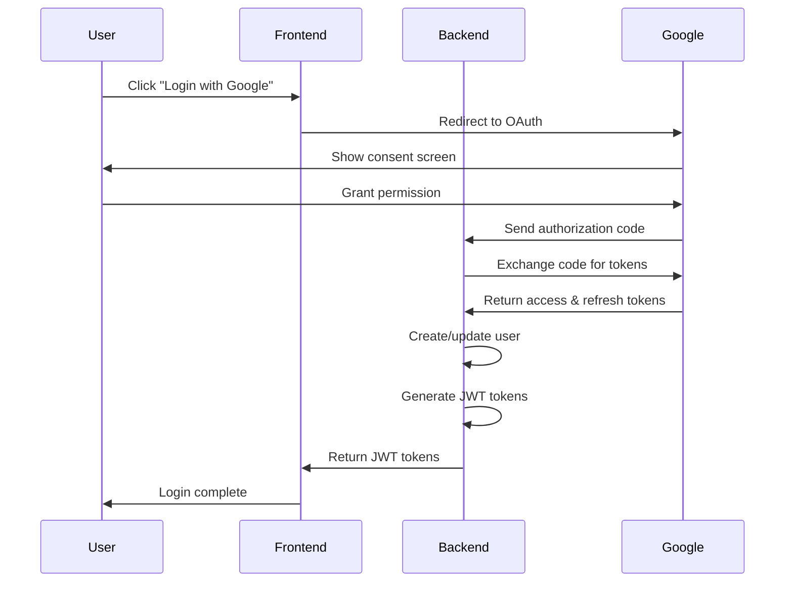
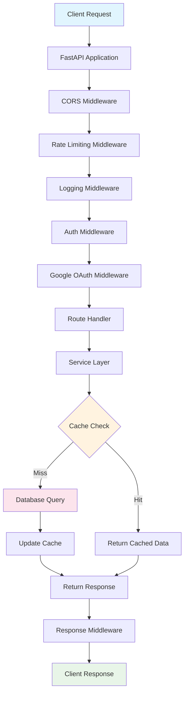
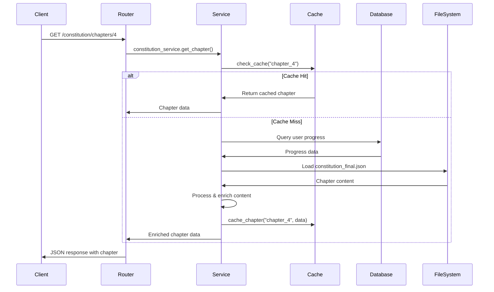
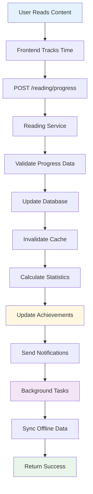
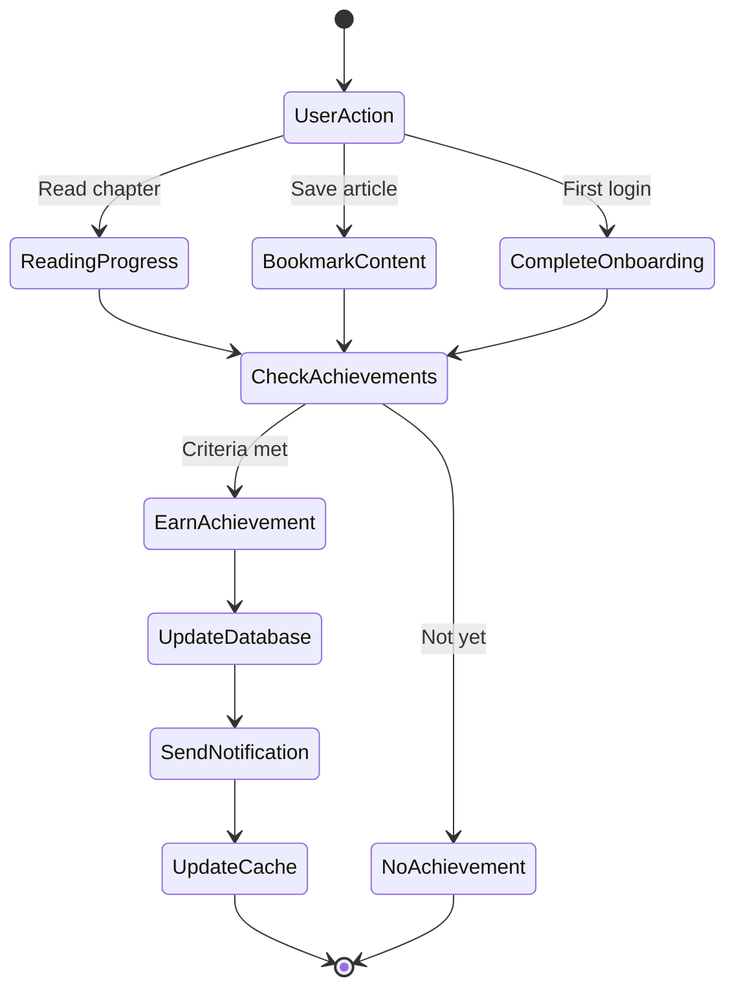
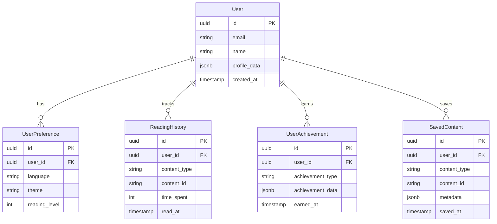
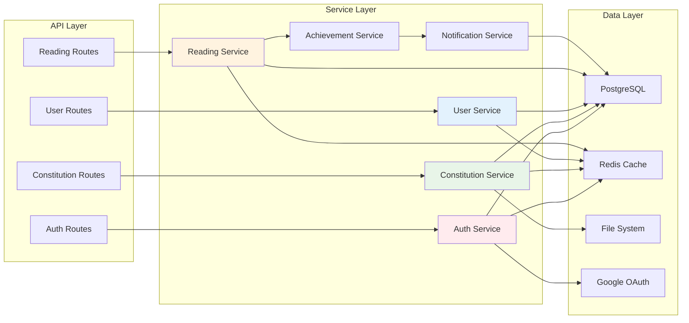
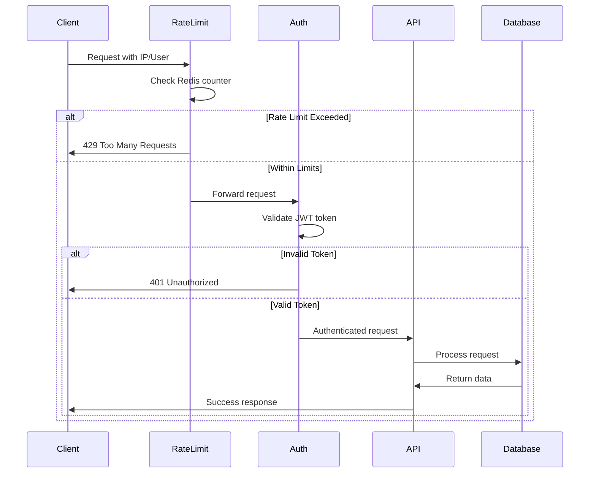

# Katiba360° Backend API 🇰🇪

**Backend system powering Kenya's most accessible constitutional platform**

> 🌐 **Related Repository:** [Katiba360° Frontend App](https://github.com/elijahondiek/katiba360) - The Next.js frontend application

## 🚀 Calling All Backend Developers!

We need your expertise to build a robust backend that serves constitutional knowledge to millions of Kenyans! Whether you're experienced with **Python**, **FastAPI**, **PostgreSQL**, or **API design** – your skills can make a real impact.

### 🎯 Critical Backend Features Needed

1. **🌍 Translation Management System** (Highest Priority!)
   - API endpoints for local dialect translations
   - Translation workflow management
   - Content versioning for different languages
   - Translation validation and approval system

2. **📝 Constitution Data Completion**
   - Scripts to identify and flag missing content
   - Data validation and integrity checks
   - Import tools for official constitution updates
   - Automated content synchronization

3. **👤 Mzalendo Profile System**
   - **Achievements Engine:** Gamified constitutional learning
   - **Offline Content API:** Critical content caching endpoints
   - **Settings Management:** User preferences and personalization
   - **Overview Dashboard:** User progress and statistics
   - **Profile Analytics:** Reading patterns and engagement metrics

4. **🔊 Text-to-Speech Enhancement**
   - TTS API integration and management
   - Voice selection and customization
   - Audio caching and optimization
   - Accessibility compliance

5. **📱 Offline-First Architecture**
   - Progressive sync capabilities
   - Conflict resolution for offline changes
   - Optimized data structures for mobile
   - Background sync services

6. **⚡ Performance & Infrastructure**
   - API caching strategies
   - Database query optimization
   - Rate limiting and security
   - Monitoring and logging improvements

## 📋 Current System Overview

Katiba360 Backend provides a comprehensive user management and content delivery system for Kenya's constitutional platform, featuring Google OAuth integration, personalized reading experiences, achievement tracking, and multilingual support.

## ✨ Implemented Features

### 🔐 Authentication & User Management
- **Google OAuth Integration:** Secure authentication flow
- **JWT Token Management:** Access and refresh token handling
- **User Profiles:** Comprehensive user data management
- **Privacy Controls:** GDPR-compliant data handling

### 📚 Content Management
- **Constitution Data API:** Structured constitutional content
- **Chapter & Article Endpoints:** Organized content delivery
- **Search Infrastructure:** Full-text search capabilities
- **Multilingual Content:** English, Swahili, and local language support

### 📊 User Experience
- **Smart Reading Progress:** Content-aware completion tracking with dynamic thresholds
- **Reading History:** Complete reading journey tracking with detailed analytics
- **Achievement System:** Gamified learning progression
- **Notification System:** Personalized user engagement
- **Content-Based Completion:** Intelligent chapter completion based on word count and reading time

### 🌐 API Infrastructure
- **FastAPI Framework:** High-performance async API
- **OpenAPI Documentation:** Auto-generated API docs
- **Database Migrations:** Alembic migration management
- **Error Handling:** Comprehensive exception management

### 🆕 Recent Improvements
- **Content-Aware Completion Logic:** Dynamic completion thresholds based on chapter word count
- **Reading Time Calculation:** Intelligent reading time estimation (200 WPM baseline)
- **Optimized Progress Tracking:** Enhanced reading progress service with better caching
- **Completion Threshold Formula:** `(word_count / 200_wpm) * 0.3 = completion_threshold`
- **Minimum Threshold Protection:** Maintains 2-minute minimum for backward compatibility

## 🛠 Tech Stack

- **Framework:** FastAPI (Python 3.9+)
- **Database:** PostgreSQL with SQLAlchemy ORM
- **Authentication:** JWT tokens, Google OAuth 2.0
- **Caching:** Redis (optional)
- **Documentation:** Swagger UI / OpenAPI
- **Migrations:** Alembic
- **Testing:** pytest
- **Deployment:** Docker, Uvicorn

## 🚀 Quick Start

### Prerequisites
- Python 3.9+
- PostgreSQL database
- Redis (optional, for caching)
- Google OAuth credentials

### 1. Clone & Setup

```bash
git clone https://github.com/elijahondiek/katiba360-backend.git
cd katiba360-backend

# Set up virtual environment
python -m venv venv

# Activate virtual environment
# Windows:
venv\Scripts\activate
# macOS/Linux:
source venv/bin/activate

# Install dependencies
pip install -r requirements.txt
```

### 2. Environment Configuration

```bash
cp .env.example .env
# Edit .env with your database credentials and Google OAuth settings
```

### 3. Database Setup

```bash
# Run migrations
alembic upgrade head

# Optional: Seed with sample data
python scripts/seed_data.py
```

### 4. Start Development Server

```bash
uvicorn main:app --reload --host 0.0.0.0 --port 8000
```

### 5. Access API Documentation
- **Swagger UI:** http://localhost:8000/docs
- **ReDoc:** http://localhost:8000/redoc

## 📊 Constitution Data

### Current Status
Our constitutional content is stored in `src/data/processed/constitution_final.json`:

- ✅ **Complete:** Basic chapter and article structure
- ⚠️ **Incomplete:** Some sections missing due to programmatic extraction
- 🔍 **Needs Review:** Content accuracy verification needed

### 🤝 How You Can Help

1. **Data Validation**
   - Compare with [official constitution](https://new.kenyalaw.org/akn/ke/act/2010/constitution/eng@2010-09-03)
   - Identify missing articles, clauses, or sections
   - Verify existing content accuracy

2. **Translation Contributions**
   - Add local language translations
   - Review existing Swahili translations
   - Create language-specific terminology databases

3. **Content Enhancement**
   - Add simplified explanations for complex legal terms
   - Create practical examples for constitutional concepts
   - Develop educational content and quizzes

## 🏗 Project Architecture

```
katiba360-backend/
├── alembic/                 # Database migrations
├── src/
│   ├── core/               # Core application configuration
│   │   └── config.py       # Environment settings
│   ├── models/             # SQLAlchemy database models
│   │   ├── user_models.py  # User, profile, preferences
│   │   └── reading_progress.py # Reading tracking
│   ├── routers/            # FastAPI route handlers
│   │   ├── auth_routes.py          # Authentication endpoints
│   │   ├── constitution_routes.py  # Content delivery
│   │   ├── user_routes.py          # User management
│   │   ├── achievement_routes.py   # Gamification
│   │   └── reading_routes.py       # Progress tracking
│   ├── services/           # Business logic layer
│   │   ├── auth_service.py         # Authentication logic
│   │   ├── constitution_service.py # Content management
│   │   ├── user_service.py         # User operations
│   │   └── achievement_service.py  # Achievement engine
│   ├── schemas/            # Pydantic data models
│   ├── middleware/         # Custom middleware
│   ├── utils/              # Utility functions
│   └── data/              # Constitution data
│       └── processed/
│           └── constitution_final.json
├── main.py                 # Application entry point
└── requirements.txt        # Dependencies
```

## 🏗 Complete Backend Architecture Flow

### 🔐 Authentication Flow



### 🔄 Request Processing Flow



### 🎯 Constitution Content Flow



### 📖 Reading Progress Tracking



### 🎮 User Achievement System



### 💾 Data Storage Architecture



### 🔧 Service Layer Architecture



### 🛡️ Security & Rate Limiting



## 🤝 Contributing

### 🔥 High-Impact Contribution Areas

1. **🌍 Translation Infrastructure**
   - Build translation management APIs
   - Create content versioning system
   - Implement translation validation workflows

2. **📊 Analytics & Insights**
   - User engagement analytics
   - Reading pattern analysis
   - Content popularity tracking
   - Performance monitoring

3. **🔧 API Development**
   - New feature endpoints
   - API optimization and caching
   - Rate limiting and security
   - Documentation improvements

4. **🧪 Testing & Quality**
   - Unit and integration tests
   - API endpoint testing
   - Performance testing
   - Security auditing

### 📋 Development Workflow

1. **Fork the repository** and create feature branch from `main`
2. **Set up development environment** following Quick Start guide
3. **Check existing issues** or create new ones for features/bugs
4. **Follow Python best practices:** Type hints, docstrings, PEP 8
5. **Write comprehensive tests** for new features
6. **Update API documentation** if adding new endpoints
7. **Submit pull request** with detailed description

### 🧪 Testing

```bash
# Run all tests
pytest

# Run with coverage
pytest --cov=src

# Run specific test file
pytest tests/test_auth.py
```

### 📚 API Documentation

When adding new endpoints:
- Use proper FastAPI decorators and type hints
- Add comprehensive docstrings
- Include example requests/responses
- Update OpenAPI tags and descriptions

## 🌟 Join Our Mission

**Our Impact:** Your backend code directly serves constitutional knowledge to millions of Kenyans, promoting civic education and democratic participation.

**What We're Building:** A scalable, accessible platform that breaks down barriers to constitutional literacy in Kenya.

### 🔗 Get Connected

- **GitHub Issues:** [Report bugs or request features](https://github.com/elijahondiek/katiba360-backend/issues)
- **API Testing:** Use Swagger UI at http://localhost:8000/docs
- **Frontend Repository:** [Katiba360° Frontend App](https://github.com/elijahondiek/katiba360)
- **Project Lead:** [@WebShrewd](https://x.com/WebShrewd)
- **Support Development:** [Buy me a coffee](https://buymeacoffee.com/Teksad)

## 📈 Performance & Monitoring

### Current Metrics
- ⚡ **Response Time:** <200ms for most endpoints
- 🔄 **Uptime:** 99.9% target availability
- 📊 **Database:** Optimized queries with indexing
- 🔒 **Security:** JWT tokens, rate limiting, CORS protection

### Monitoring Stack
- **Logging:** Structured logging with rotation
- **Error Tracking:** Comprehensive error handling
- **Performance:** Query optimization and caching
- **Health Checks:** Endpoint monitoring

## 📜 License

This project is licensed under the MIT License - see the LICENSE file for details.

## 🙏 Acknowledgments

- Constitution of Kenya, 2010
- FastAPI and SQLAlchemy communities
- Google OAuth platform
- All contributors and the Kenyan developer community
- Organizations promoting digital civic education

---

**Let's build the backend that empowers constitutional literacy in Kenya! 🇰🇪**

*Your API endpoints can deliver constitutional knowledge to millions of Kenyans.*